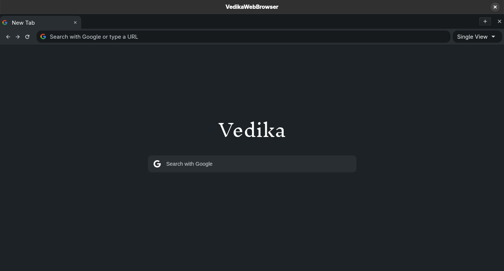
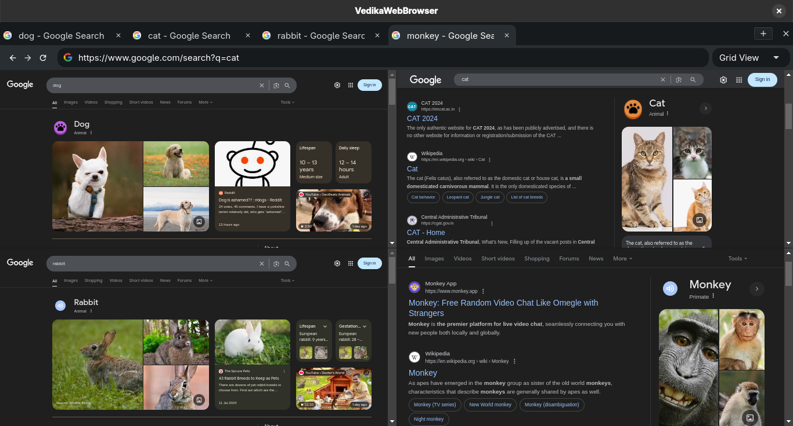

# Vedika Web Browser

Vedika is a productivity-focused web browser tailored for researchers and deep work. Designed to minimize distractions, it offers a clean, efficient interface for focused online exploration.

Built using the Qt framework for the GUI and Qt WebEngine for rendering web content.

## Screenshots

## Contributing

Contributions are welcome! If you have suggestions, bug reports, or improvements, feel free to open an issue or submit a pull request.

<<<<<<< HEAD
For the current development version, please refer to the `dev` branch.
=======
## Known Issues

See [KNOWN_ISSUES.md](./KNOWN_ISSUES.md) for current limitations and bugs.
>>>>>>> dev

## License

This project is licensed under the GNU General Public License v3.0.  
See the [LICENSE](./LICENSE) file for details.

## Support My Work

If you find my work useful, consider supporting me by buying me a coffee!

